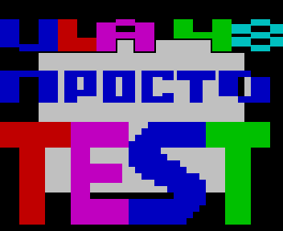
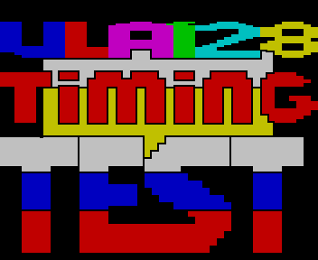
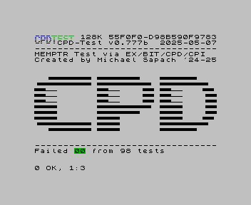
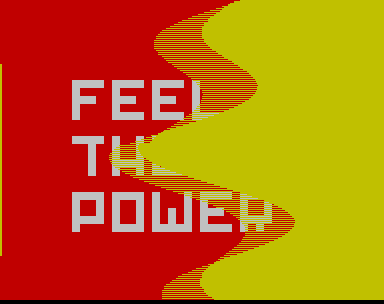

# zxgo-v3

A ZX Spectrum emulator written in Go.

Third generation of the project (after `zxgo` in Go and `zxcpp` in C++), written
from scratch.

**Machines**: 48K, 128K, +2A/+3, Pentagon 128 and Pentagon 512, each with its own
contention and timing. Tape (.tap/.tzx), TR-DOS and +3 disks, snapshots, and a
desktop front end - one window per tool - with sessions, replays and a settings
window. `MANUAL.md` is the whole of it.

```bash
go build -o zxgo ./cmd/zxgo

./zxgo                                  # 48K, desktop windows
./zxgo -model 128k -tap game.tzx        # CMD+P to play
./zxgo -model pentagon -disk game.trd
```

**Read [MANUAL.md](MANUAL.md)** for the switches, the windows, key bindings,
sessions, replays and profiling - it is everything you need to use the emulator.

Working on the emulator instead? [CLAUDE.md](CLAUDE.md) is the way in: rules, build
and test, the MCP server. It points at the design and state documents
(`ARCHITECTURE.md`, `UI_DESIGN.md`, `STATE_DESIGN.md`, `ZXSTATE_SPEC.md`,
`MCP_SERVER.md`) and at the planning ones (`NEXT_STEPS.md`, `KNOWN_BUGS.md`).

## Screenshots





